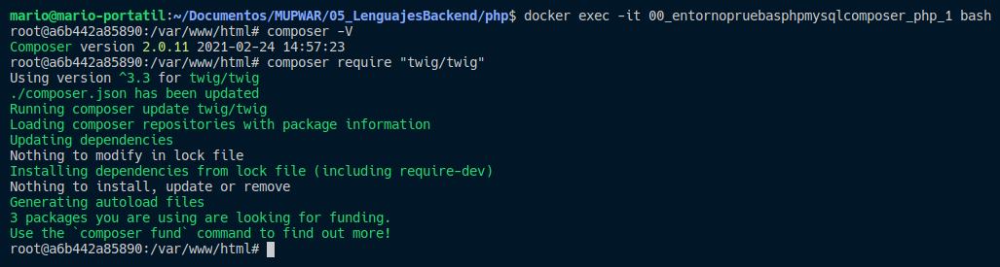

# Entorno para trabajar con php y mysql. [php viene con composer instalado dentro del contenedor]

Nuestro proyecto estará ubicado dentro de la carpeta /app.

He dejado un pequeño ejemplo "index.php" de configuración dentro de la carpeta para comprobar que conecta correctamente con la base de datos.

## Levantamos nuestro entorno docker

*** Entrar dentro del directorio donde se ubica el archivo docker-compose.yml para poder ejecutar el siguiente comando desde terminal.

```
docker-compose up -d --build
```

## Acceder al navegador para ver nuestra app y gestor de bases de datos adminer:

- App: http://localhost:8090

- Adminer: http://localhost:8091

## Instalar cualquier paquete con composer


- Entramos dentro de nuestro contenedor de php previemante creado:

*** cambiar el nombre del contenedor al nombre del contenedor creado en vuestra máquina (seguramente sea nombreDeCarpetaDeProyecto_php_1)

```
docker exec -it 00_entornopruebasphpmysqlcomposer_php_1 bash
```

- Nos aseguramos que composer está correctamente instalado:

```
composer -V
```

- Instalamos cualquier paquete con composer (por ejemplo twig):

```
composer require "twig/twig"
```

