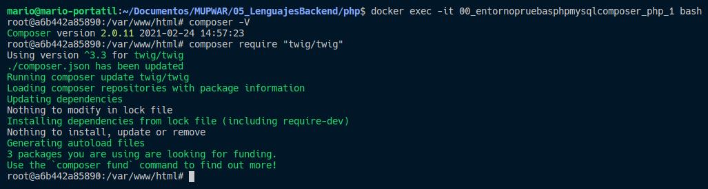

# Entorno para trabajar con php y mysql [php con composer instalado dentro del contenedor].

Nuestro proyecto estará ubicado dentro de la carpeta /app.

He dejado un pequeño ejemplo "index.php" de configuración dentro de la carpeta para comprobar que conecta correctamente con la base de datos.

## 1. Clonar el repositorio

```
git clone https://github.com/janfribogar/mupwar-php-entorno-pruebas.git
```

## 2. Levantamos nuestro entorno docker

*** Entrar dentro del directorio donde se ubica el archivo docker-compose.yml para poder ejecutar el siguiente comando desde terminal.

```
docker-compose up -d --build
```

## 3. Acceder al navegador para ver nuestra app y gestor de bases de datos adminer:

- App: http://localhost:8090

- Adminer: http://localhost:8091

## 4. Instalar cualquier paquete con composer


- Entramos dentro de nuestro contenedor de php previemante creado:

*** Cambiar el nombre del contenedor al nombre del contenedor creado en vuestra máquina (seguramente sea nombreDeCarpetaDeProyecto_php_1 --> mupwar-php-entorno-pruebas_php_1)

```
docker exec -it mupwar-php-entorno-pruebas_php_1 bash
```

- Nos aseguramos que composer está correctamente instalado:

```
composer -V
```

- Instalamos cualquier paquete con composer (por ejemplo twig):

```
composer require "twig/twig"
```



## 5. Bakcup & restore de la base de datos

Si creais tablas y/o añadis datos en la base de datos, realizar un backup de ella ya que si eliminais el contenedor se borrara toda la estructura de la base de datos (tanto tablas como datos).

Si creais de nuevo el contenedor podeis volver a cargar el backup de la base de datos.

*** Cambiar el nombre del contenedor al nombre del contenedor creado en vuestra máquina (seguramente sea nombreDeCarpetaDeProyecto_db_1 --> mupwar-php-entorno-pruebas_db_1)

*** Cuidado si habeis cambiado el nombre de la base da datos "app_db" o la password del usuario root "root_pass" en el docker-compose.

- Backup base de datos:

```
docker exec mupwar-php-entorno-pruebas_db_1 /usr/bin/mysqldump -u root --password=root_pass app_db > ./dbBackup/backup.sql
```

- Restore base de datos:

```
cat ./dbBackup/backup.sql | docker exec -i mupwar-php-entorno-pruebas_db_1 /usr/bin/mysql -u root --password=root_pass app_db
```
